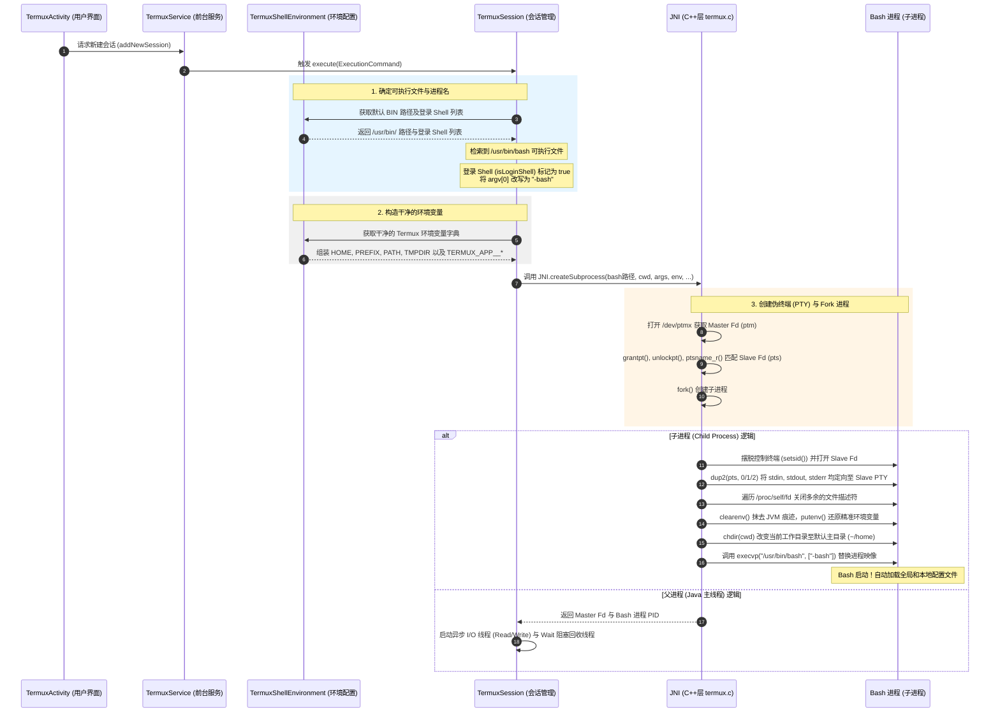

# Termux Bash 启动与配置流程分析

本文档深入剖析了在 Bootstrap 安装完成后，Termux 终端是如何寻找并启动 `/data/data/com.termux/files/usr/bin/bash` 的，以及在进程启动、伪终端（PTY）建立、环境变量构造、配置文件加载等阶段的具体实现细节。

---

## 1. 核心启动与配置链路图

以下是 Bash 从用户触发新建会话，到 native 重定向、最终执行 `execvp` 启动的全局调用图景：



---

## 2. 深度步骤解析

### 第一阶段：登录 Shell 的寻找与伪装

在 [TermuxSession.java](file:///Users/duoduo/Documents/Code/termux-app/termux-shared/src/main/java/com/termux/shared/termux/shell/command/runner/terminal/TermuxSession.java) 的 `execute` 方法中：
1. **自动搜寻解释器**：如果 `executionCommand.executable` 未指定，系统会在 `defaultBinPath`（即 `/data/data/com.termux/files/usr/bin`）下按优先级依次检索可用的 Shell 解释器列表：
   `UnixShellEnvironment.LOGIN_SHELL_BINARIES = {"login", "bash", "zsh", "fish", "sh"}`。
   检索到 `bash` 且其具备可执行权限时，将其锁定为目标程序路径。
2. **伪装登录 Shell (argv[0] 改写)**：
   如果是上述列表匹配出的解释器，`isLoginShell` 标记会被设为 `true`。此时，系统会对传递给底层的参数列表进行关键改写：
   ```java
   String processName = (isLoginShell ? "-" : "") + ShellUtils.getExecutableBasename(executionCommand.executable);
   String[] arguments = new String[commandArgs.length];
   arguments[0] = processName; // argv[0] 改写为 "-bash"
   ```
   > [!IMPORTANT]
   > **为什么要改写 `argv[0]` 为 `-bash`？**
   > 这是经典 UNIX 系统中触发交互式登录 Shell（Login Shell）的标准规约。当 Bash 检测到自己的第一个参数以 `-` 开头时，它会自动开启登录 Shell 模式，不仅会加载非交互式配置，更会**依次尝试读取并运行 `/etc/profile`、`~/.bash_profile`、`~/.bash_login` 和 `~/.profile`**，从而自动将用户定制的环境完美呈现。

---

### 第二阶段：精细组装环境变量

在启动 Bash 之前，Termux 决不能直接沿用 Android 虚拟机父进程残留的杂乱环境变量。在 [TermuxShellEnvironment.java](file:///Users/duoduo/Documents/Code/termux-app/termux-shared/src/main/java/com/termux/shared/termux/shell/command/environment/TermuxShellEnvironment.java) 中，系统会对环境变量进行彻底净化和针对性构建：

1. **核心 UNIX 环境变量**：
   - `HOME`：`/data/data/com.termux/files/home` （即用户的家目录 `~`）
   - `PREFIX`：`/data/data/com.termux/files/usr` （Termux 的根路径）
   - `TMPDIR`：`/data/data/com.termux/files/usr/tmp` （临时文件存放目录）
   - `PATH`：`/data/data/com.termux/files/usr/bin` （完全把系统级的 `/system/bin` 等挪到后方或剔除，保证所有依赖使用 Termux 自身编译的可执行软件）。
2. **剔除 `LD_LIBRARY_PATH`**：
   - 早期 Android 5/6 版本中由于动态链接限制需要该变量指向 `/usr/lib`。
   - 自 Android 7 之后，为了防范系统动态链接崩溃与安全沙盒限制，所有的 Termux 二进制在编译时均依赖 `DT_RUNPATH` 属性，故在此处默认安全将其剔除。
3. **安全性与状态感知注入 (`TERMUX_APP__*`)**：
   为了让 Bash 内运行的进程和脚本具备感知当前 Termux 应用状态的能力，[TermuxAppShellEnvironment.java](file:///Users/duoduo/Documents/Code/termux-app/termux-shared/src/main/java/com/termux/shared/termux/shell/command/environment/TermuxAppShellEnvironment.java) 注入了大量元数据变量：
   - `TERMUX_VERSION` / `TERMUX_APP__VERSION_NAME`：当前应用版本。
   - `TERMUX_APP__PID` / `TERMUX_APP__UID`：Termux 主应用的进程 ID 与系统 UID。
   - `TERMUX_APP__PACKAGE_NAME`：包名 `com.termux`。
   - `TERMUX_APP__SE_PROCESS_CONTEXT`：当前进程的 SELinux 安全上下文。
   - `TERMUX_APP__FILES_DIR`：内部数据存储路径。

---

### 第三阶段：Native PTY 伪终端的创建与 `execvp`

通过 JNI，在 C 层 [termux.c](file:///Users/duoduo/Documents/Code/termux-app/terminal-emulator/src/main/jni/termux.c) 中完成系统调用：

1. **PTY 管道建立**：
   - `open("/dev/ptmx", O_RDWR | O_CLOEXEC)` 打开伪终端主设备（Master Device），获得文件描述符 `ptm`。
   - 调用 `grantpt(ptm)`、`unlockpt(ptm)`、以及 `ptsname_r(ptm, devname, sizeof(devname))` 申请并获取伪终端从设备（Slave Device）的系统设备名（如 `/dev/pts/1`）。
   - 配置属性：修改 `termios` 结构体使能 `IUTF8`（保证 UTF-8 字符集支持），并且禁用流控制键（`IXON | IXOFF`），防止用户误触 `Ctrl + S` 锁定屏幕显示。
2. **进程 Fork 与会话独立**：
   - 调用 `fork()`。
   - **子进程逻辑**：
     - 调用 `setsid()` 摆脱旧会话，创立新的控制终端群组。
     - 打开刚才获取的从设备文件描述符 `pts = open(devname, O_RDWR)`。
     - **重定向标准流**：调用 `dup2(pts, 0)`、`dup2(pts, 1)`、`dup2(pts, 2)` 把子进程的标准输入、输出、错误全都嫁接重定向到该 `pts` 伪终端设备上。
     - **沙盒清空与重构**：
       - 打开并遍历 `/proc/self/fd`，将所有文件描述符（除了标准 0,1,2）全部强制 `close(fd)`，防止 Java 虚拟机的内部套接字泄露。
       - 调用 `clearenv()` 抹除全部旧的环境变量。
       - 遍历通过 JNI 传递进来的干净环境变量字典数组，循环调用 `putenv()` 精准重建。
     - **切入工作目录**：`chdir(cwd)`，即进入用户的 `~/home`。
     - **映像替换**：调用 `execvp(cmd, argv)`，将当前的子进程直接替换为 `/data/data/com.termux/files/usr/bin/bash` 进程，且携带重写后的进程名 `-bash`。
3. **父进程 I/O 监听与退出等待**：
   - 返回 Java 层终端主 Fd。
   - 开启 `TermSessionInputReader` 线程，持续通过 Master Fd 读取 Bash 的输出内容，送入 `ByteQueue` 缓冲，并投递到 Handler 由 UI 组件 `TerminalEmulator` 渲染展现。
   - 开启 `TermSessionOutputWriter` 线程，将用户软键盘、快捷键或物理键盘的操作投递至 Master Fd 输送给 Bash 进程。
   - 开启 `TermSessionWaiter` 线程，阻塞式调用 `JNI.waitFor(mShellPid)`（内部运行 `waitpid` 系统调用）。当 Bash 进程被杀死或主动输入 `exit` 退出时，该线程被唤醒，进而触发 `cleanupResources` 回收 I/O 流，标志会话完全消亡。

---

### 第四阶段：Shebang (`#!`) 脚本自适应拦截与解释器重定向

在 Java 层准备参数的阶段，[TermuxShellUtils.setupShellCommandArguments](file:///Users/duoduo/Documents/Code/termux-app/termux-shared/src/main/java/com/termux/shared/termux/shell/TermuxShellUtils.java) 方法会深度介入并对目标执行程序执行以下检测与调整，这是 Termux 在无 Root 环境下兼容运行绝大多数标准 Linux 脚本的关键基石：

1. **ELF 二进制直接运行**：
   - 提取文件头部前 4 个字节，如果是经典的 `0x7F 'E' 'L' 'F'` 标志，说明是原生编译二进制，不进行任何干预，直接交由内核载入执行。
2. **Shebang `#!` 路径的动态替换**：
   - 如果检测到文件以字符 `#!` 开头，说明是一个脚本文件。Termux 将自动解析该首行中的解释器可执行路径。
   - 若解释器使用的是 Linux 系统下硬编码的传统标准路径（以 `/usr` 或 `/bin` 开头，如 `#!/bin/sh` 或 `#!/usr/bin/python`），由于 Android 系统中不存在这些路径，Termux 会自动提取末尾的文件名（如 `sh`、`python`），并将其重塑为指向本地 Termux $PREFIX 内部的二进制路径：`$PREFIX/bin/sh` 或 `$PREFIX/bin/python`：
     ```java
     if (shebangExecutable.startsWith("/usr") || shebangExecutable.startsWith("/bin")) {
         String[] parts = shebangExecutable.split("/");
         String binary = parts[parts.length - 1];
         interpreter = TermuxConstants.TERMUX_BIN_PREFIX_DIR_PATH + "/" + binary; // 重定向至 $PREFIX/bin/[binary]
     }
     ```
   - 重定向得到的解释器会被插入作为最终执行 `execvp` 的真实执行目标，而原脚本路径及后续参数则后移作为其运行参数。
3. **文本脚本自适应 sh 包裹**：
   - 如果文件既不是 ELF 二进制，也没有任何 shebang 头部，Termux 会认为这是一个普通的纯文本脚本文件。
   - 为了防止直接执行时触发格式错误，也为了防止其误调用 Android 系统本身不完整的 `/system/bin/sh`，系统会自适应在命令最前面插入 Termux 标准的 **`$PREFIX/bin/sh`** 解释器对其进行包裹驱动。

---

### 第五阶段：Failsafe 安全抢救会话机制

如果由于用户误改 `.bashrc`、写死死循环，或是误删/损坏了 `$PREFIX` 目录内的关键 C 库导致 Bash 一启动就立即闪退崩溃，用户将面临“无法进入终端、无法排查故障”的窘境。为此，Termux 内嵌了 **Failsafe（安全模式）** 会话启动逻辑：

1. **全面绕过 Bootstrap**：
   - 当用户长按 "New Session" 并选择 "Failsafe" 时，或者由于异常保护机制触发时，`TermuxService` 启动会话将彻底**不使用** `$PREFIX/bin/bash`，也不检索任何本地 Bootstrap 解释器。
2. **强制降级为 Android 原生 Shell**：
   - 强制将可执行目标指定为 Android 手机系统自身的 **`/system/bin/sh`**。
3. **隔离受损环境**：
   - 彻底擦除并**不加载任何 Termux 环境变量**（如 `$PREFIX` 相关的 `PATH`、`LD_LIBRARY_PATH` 等），使用最基础的原生 Android 环境运行。
4. **诊断与修复用途**：
   - 用户在这个极简的 Android 终端内，虽然无法直接运行 Termux 的 `apt` 包，但是可以通过手机自带的基础工具（或利用绝对路径调用）编辑受损的 `~/.bashrc` 配置文件，或是对损坏的 usr 目录进行重置与备份，提供了一条黄金救援通道。

---

## 3. Bash 核心配置文件的加载时序

由于系统是通过伪装 `-bash` 引导登录 Shell 的，Bash 在启动后将遵循严格的标准配置文件加载时序：

1. **读取系统级全局配置**：
   首先尝试寻找并解析系统全局初始配置文件 `/data/data/com.termux/files/usr/etc/bash.bashrc`。
   > [!TIP]
   > 在 Termux 的默认 `bash.bashrc` 中，官方通常会配置一些通用 alias，设定颜色化的 `PS1` 终端提示符，或者注入以下代码来**自动加载先前写入的 `termux.env` 环境文件**：
   > ```bash
   > if [ -f /data/data/com.termux/files/usr/etc/termux/termux.env ]; then
   >     . /data/data/com.termux/files/usr/etc/termux/termux.env
   > fi
   > ```
2. **加载用户级个人配置**：
   随后，Bash 会自动扫描用户主目录 `/data/data/com.termux/files/home` 并**按顺序仅仅加载最先找到的那个**用户配置文件：
   - 第一顺位：`~/.bash_profile`
   - 第二顺位：`~/.bash_login`
   - 第三顺位：`~/.profile`
3. **用户自定义非登录 Shell 的融合**：
   由于大多数 Linux 用户的自定义变量和 alias 都喜欢写在 `~/.bashrc` 中，而在登录 Shell 模式下，Bash 默认**不会**直接去读取 `~/.bashrc`。
   因此，Termux 的默认配置模板通常会在用户的 `~/.bash_profile` 中添加如下引导代码，实现两者的无缝加载融合：
   ```bash
   # 如果存在 ~/.bashrc，则自动将其 source 进来
   if [ -f ~/.bashrc ]; then
       . ~/.bashrc
   fi
   ```
