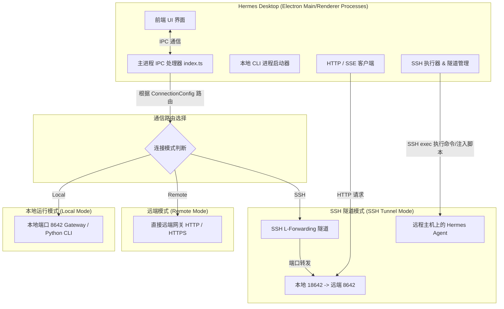

# Hermes Desktop 需求与远程 Agent 交互实现细节报告

本报告对 `hermes-desktop` 的源码进行深度剖析，重点解构 Hermes Desktop 如何通过 SSH 通道以及 HTTP/SSE API 远程操作、管理及调用 **Hermes Agent** 的核心技术方案。报告通过技术实现与功能细节的双向推导，还原其产品需求和架构设计，为后续的研发与集成提供权威参考。

---

## 1. 架构设计与通信模式概述

Hermes Desktop 采用 Electron 框架构建，支持与 Hermes Agent 在三种模式下协同工作：



### 1.1 三种通信模式解析

1. **本地模式 (Local Mode)**：
   * **运行机制**：自动加载本地 Python 虚拟环境，并通过子进程直接唤起本地的守护进程网关（`hermes gateway`）或回退至 Python 命令行（`hermes chat`）。
   * **通信协议**：通过本地 HTTP API Server (`http://127.0.0.1:8642`) 进行通信。
2. **纯远端模式 (Remote Mode)**：
   * **运行机制**：不进行任何本地计算或进程唤起，直接将 API 请求指向外部已公开的域名或 IP 的 Gateway 服务。
   * **通信协议**：标准的 HTTPS / HTTP 协议，提供 Bearer API Key 认证。
3. **SSH 隧道模式 (SSH Tunnel Mode) [核心分析对象]**：
   * **运行机制**：通过在本地与远程主机之间建立 SSH 局部端口转发（Local Port Forwarding）隧道，使得本地的 API 请求能安全地穿透内网直接访问远程只监听在 `127.0.0.1` 上的 Hermes API Server；同时，Desktop 主进程通过 SSH 远程通道（`ssh exec`）以“终端命令”和“动态 Python 脚本注入”的方式，对远程 Agent 的配置文件、SQLite 数据库、文件系统、守护进程进行强有力的 CRUD 操作。

---

## 2. SSH 通信与通道生命周期管理

### 2.1 SSH 隧道建立流程 (`ssh-tunnel.ts`)

为了能够使 Desktop 界面以超低的延迟和极高的安全性访问远程的 `/v1/chat/completions` API，系统在后台开启了一个长链接 SSH 隧道进程。

* **SSH 转发指令构建**：
  ```bash
  ssh -N -L <localPort>:127.0.0.1:<remotePort> -p <port> -i <keyPath> -o StrictHostKeyChecking=accept-new -o BatchMode=yes -o ExitOnForwardFailure=yes -o ServerAliveInterval=30 -o ServerAliveCountMax=3 <username>@<host>
  ```
  * `-N`：不执行远程指令，专用于端口转发。
  * `-L`：本地端口绑定（默认 `18642`），将请求转发至远程主机的 `127.0.0.1:8642`。
  * `StrictHostKeyChecking=accept-new`：自动接受首次连接的远程主机指纹，防止阻塞连接。
  * `ExitOnForwardFailure=yes`：如果转发失败，SSH 进程立刻退出，以便 Desktop 捕捉异常并向用户报错。
  * `ServerAliveInterval=30 / ServerAliveCountMax=3`：每 30 秒发送一次心跳包，连续 3 次无响应则断开，维持链路健康活性。

* **健康度探针设计 (`/health` HTTP check)**：
  在 SSH 子进程拉起后，系统并不会盲目信任其就绪状态，而是会在本地不断轮询探测：
  ```typescript
  // 轮询请求转发到本地的健康检查接口，探测直到返回 statusCode === 200
  http.request(`http://127.0.0.1:${localPort}/health`, { method: "GET", timeout: 1500 });
  ```
  只有探测通过，才会宣告隧道进入 Active（激活）状态，并开始承载业务流量。

### 2.2 远程指令执行与 Python 脚本动态注入 (`ssh-remote.ts`)

除了 API 端口转发，许多复杂的管理功能（如查询会话数据库、编辑特定 YAML 缩进块、查询远程系统状态）无法直接通过单一 API 解决。因此，Desktop 采用了一套精妙的 **“远程 Exec” 与 “动态 Python 脚本注入”** 方案。

```
                    ┌─────────────────────────┐
                    │  Hermes Desktop (Node)  │
                    └────────────┬────────────┘
                                 │ 1. 组装 Python 脚本 / 命令
                                 ▼
                     ssh username@host "python3 -"
                                 │
         ┌───────────────────────┼───────────────────────┐
         │ 2. 将 Python 源码以 stdin 流形式写入远程进程            │ (SSH 传输密道)
         └───────────────────────┬───────────────────────┘
                                 │
                                 ▼
                    ┌─────────────────────────┐
                    │ 远程主机运行 python3 -    │
                    └────────────┬────────────┘
                                 │ 3. 解析 std.in 并执行本地系统调用/SQLite
                                 ▼
                    ┌─────────────────────────┐
                    │ 读写数据库/编辑配置并 JSON 输出│
                    └────────────┬────────────┘
                                 │ 4. 捕获 stdout 结果
                                 ▼
                    ┌─────────────────────────┐
                    │   Desktop 解析 JSON 返回   │
                    └─────────────────────────┘
```

#### 2.2.1 核心命令执行器 (`sshExec`)
```typescript
export function sshExec(config: SshConfig, command: string, stdin?: string): Promise<string> {
  // spawn('ssh', ['-o', 'BatchMode=yes', '-i', keyPath, '-p', port, 'user@host', command])
}
```
所有远程指令执行均包装在 `sshExec` 中，并带有自动超时控制（默认 30 秒）。

#### 2.2.2 动态 Python 脚本注入器 (`sshPython`)
为避免在远端服务器上预先部署复杂的管理脚本，Desktop **直接在 Node.js 中组装 Python 源码，然后通过 SSH 命令管道将其输入至远程的 `python3` 解析器** 执行：
```typescript
function sshPython(config: SshConfig, script: string, stdin?: string): Promise<string> {
  if (stdin === undefined) {
    // 脚本没有自定义输入，直接执行 python3 -，并将 script 作为 stdin 注入
    return sshExec(config, "python3 -", script);
  }
  // 如果脚本需要加载外部变量，转为命令行 -c 并将 payload 充当输入流
  return sshExec(config, `python3 -c ${shellQuote(script)}`, stdin);
}
```

> [!NOTE]
> **避开 `/usr/local/bin/hermes` 权限屏障的巧妙策略**：
> 在很多服务端部署中，默认的 `hermes` 命令会被 `/usr/local/bin/hermes` 里的 `sudo -u hermes` 封装层劫持。当通过 SSH 登录的用户就是 `hermes` 时，这会导致“不能以自身身份进行 sudo” 的报错。
> Desktop 通过在后台轮询探测三种著名的虚拟环境 Candidate 路径，巧妙地构建了一段 Bash 嗅探脚本，直接绕过全局 wrapper 运行虚拟环境中的 CLI 二进制文件：
> ```typescript
> function buildRemoteHermesCmd(args: string[], extraShell = ""): string {
>   const candidates = [
>     "$HOME/hermes-agent/.venv/bin/hermes",
>     "$HOME/.hermes/hermes-agent/.venv/bin/hermes",
>     "/opt/hermes/hermes-agent/.venv/bin/hermes",
>   ];
>   const probe = candidates.map(p => `[ -x ${p} ] && exec ${p} ${args}`).join("; ");
>   return `bash -c '${probe}; command -v hermes && exec hermes; exit 1'`;
> }
> ```

---

## 3. Hermes Desktop 核心功能与 SSH 交互细节拆解

本章节还原了主要交互功能的底层实现原理，说明每一项界面操作对于远程机器上的 Hermes Agent 究竟产生了什么动作。

### 3.1 智能对话交互 (Chat Stream & Tool Progress)

* **交互流程与需求**：
  在聊天框中，用户发送消息。要求支持文本、多模态附件（图片、文档路径等）、长上下文加载，且模型在分析时能实时输出其正在调用的工具名称（如 `🔍 search_web`）。
* **技术实现**：
  1. **请求转发**：在 SSH 模式下，直接向 `http://127.0.0.1:<localPort>/v1/chat/completions` 发起 POST 请求。
  2. **多模态数据合成 (`buildUserContent`)**：由于远端 API 往往不直接接受客户端 of 本地大二进制流，Desktop 进行了精细分类：
     * **文本与代码文件**：将其包装进类似 XML 的自定义格式段 `<file name="..." mime="...">...</file>` 中直接随 User Prompt 塞入上下文。
     * **图片资源**：转换成标准 base64 `image_url` 传入。
     * **重型非文本文件（如二进制、PDF）**：转化为引用标记 `[Attached file: /path/to/file]`，远程 Agent 的 file-reading 技能会主动通过本地路径读取。
  3. **模型思考与工具进度采集**：通过监听 HTTP SSE 流。Agent 在执行内部 Tool 时，向前端推送带有自定义事件类型的行：
     ```http
     event: hermes.tool.progress
     data: {"tool": "search_web", "label": "Searching google...", "emoji": "🔍"}
     ```
     Desktop 的主进程解析该行并发出 IPC `chat-tool-progress` 信号，从而让前端 UI 展现精美的工具进度标签。

### 3.2 记忆体与个人设定管理 (Memory & User Profile)

* **交互流程与需求**：
  用户在侧边栏“记忆”模块查看或修改 Agent 累积的关于用户和任务的长期记忆条目。
* **远程交互细节**：
  * **记忆体与用户画像文件读取**：
    Agent 的记忆由 `~/.hermes/memories/MEMORY.md`（长期结构化记忆）与 `USER.md`（用户画像定义）维护。Desktop 分别通过执行：
    ```bash
    cat -- ~/.hermes/memories/MEMORY.md
    cat -- ~/.hermes/memories/USER.md
    ```
    读取纯文本内容。
  * **结构化条目解析与更新**：
    `MEMORY.md` 内部通过特殊的“§”符号进行段落划分：
    ```markdown
    记忆条目一
    §
    记忆条目二
    ```
    Desktop 在前端解析为数组后，当用户增加/修改/删除某一记忆，主进程便重新拼接文本并调用 SSH 管道远程重写该文件：
    ```typescript
    sshWriteFile(config, "~/.hermes/memories/MEMORY.md", newContent);
    ```

### 3.3 历史会话数据库审计 (Sessions History)

* **交互流程与需求**：
  要求界面能无缝同步并分页加载历史会话列表，支持根据关键字全局检索会话中的聊天气泡。
* **远程交互细节**：
  由于会话记录和历史消息全量保存在远程机器的 SQLite 数据库 `~/.hermes/state.db` 中。为了不对远端服务带来大流量读取压力，Desktop 编写了原生 Python SQLite 查询脚本直接远程注入执行：
  * **列表读取脚本片段**：
    ```python
    import sqlite3, json, os
    db = os.path.expanduser("~/.hermes/state.db")
    conn = sqlite3.connect(db)
    rows = conn.execute("SELECT id, source, started_at, message_count, model, title FROM sessions ORDER BY started_at DESC LIMIT ? OFFSET ?", (limit, offset)).fetchall()
    # 转换为 JSON 返回给 stdout 管道
    ```
  * **全文匹配检索脚本片段**：
    ```python
    rows = conn.execute(
        "SELECT DISTINCT s.id, s.title, s.started_at, s.message_count, m.content as snippet "
        "FROM sessions s JOIN messages m ON m.session_id = s.id "
        "WHERE m.content LIKE ? ORDER BY s.started_at DESC LIMIT ?", (f"%{query}%", limit)
    ).fetchall()
    ```

### 3.4 灵魂设定配置 (Soul Settings)

* **交互流程与需求**：
  在设置页面中，用户可以修改系统级 Prompt，定制 Agent 的性格特征、专业领域背景和回复偏好（灵魂设定），并提供“一键恢复默认”功能。
* **远程交互细节**：
  * 系统 Prompt 保存在远程机器的 `~/.hermes/SOUL.md` 中。
  * 修改时，直接进行远程 SSH 文件覆写。
  * 重置时，Desktop 会将 Node 内部固化的原始 System Prompt 直接写入：
    ```typescript
    const DEFAULT_SOUL = "You are Hermes, a helpful AI assistant...";
    sshWriteFile(config, "~/.hermes/SOUL.md", DEFAULT_SOUL);
    ```

### 3.5 看板任务系统接口 (Kanban CLI integration)

* **交互流程与需求**：
  Desktop 包含一个全功能 Kanban 看板。任务的分配、挂起、流转需要与远程 Agent 本身的规划任务完美咬合。
* **远程交互细节**：
  * 看板功能完全基于远程 Agent 的底层看板服务。Desktop 对看板的所有增删改查动作，均直接映射成远程命令行工具 `hermes kanban` 的远程执行，并加上 `--json` 参数捕获标准 JSON 返回。
  * **底层调用指令字典**：
    | 前端操作 | 执行远程 CLI 指令 |
    | :--- | :--- |
    | **列表看板** | `hermes kanban list --json` |
    | **当前选定看板** | `hermes kanban current --json` |
    | **切换看板** | `hermes kanban switch <slug>` |
    | **创建任务** | `hermes kanban create-task --title <t> --description <d> --assignee <a> ...` |
    | **任务指派** | `hermes kanban assign <taskId> <assignee>` |
    | **阻碍任务** | `hermes kanban block <taskId> --reason <r>` |
    | **完成任务** | `hermes kanban complete <taskId> --result <res>` |
    | **激活触发任务流水** | `hermes kanban dispatch` |

### 3.6 平台集成配置同步 (Platform Settings & Config Parsing)

* **交互流程与需求**：
  允许用户在界面上“一键开关”各种机器人集成（如 Telegram, Slack, Webhooks, WhatsApp 等），并动态展示各个平台集成当前的联网状态。
* **远程交互细节**：
  * **查看平台是否启用**：
    读取远程的 `~/.hermes/config.yaml`。由于 YAML 文件包含高度敏感的多级缩进，为了避免文件结构遭到破坏，Desktop 编写了非常严谨的行文本缩进分析算法（`parseEnabledToolsets` / `locateInYaml`），通过寻找 `platforms:` 段下的子项（如 `telegram:` -> `enabled:`）读取其布尔值。
  * **获取连接状态**：
    远程守护网关在启动后，会将各个集成的动态活性（如 `connected` / `disconnected` / `running`）写入远程临时状态文件 `~/.hermes/gateway_state.json`。Desktop 通过 SSH 获取并解析：
    ```typescript
    const raw = await sshReadFile(config, "$HOME/.hermes/gateway_state.json");
    const platforms = JSON.parse(raw).platforms || {};
    // 读取返回状态 platforms['telegram'].state
    ```
  * **开关操作并自动重载**：
    在 SSH 修改完 `config.yaml` 对应节点的 `enabled: true/false` 之后，为了能让修改立刻生效，主进程会在检测到平台状态被改变时，**自动向远程主机发送重启网关的指令链**：
    ```bash
    hermes gateway stop && nohup hermes gateway start > $HOME/.hermes/gateway.log 2>&1 &
    ```

### 3.7 模型库与提供商设置 (Models & Provider)

* **交互流程与需求**：
  允许用户在远程主机上切换底座大模型，并能在“模型库”中持久化保存多套配置（如 DeepSeek, OpenRouter, Local Ollama）。
* **远程交互细节**：
  * **模型配置注入**：通过在远程修改配置文件 `config.yaml` 的 `model` 顶级区块：
    * 修改 `model.provider` (如 `openai` / `anthropic` / `custom`)
    * 修改 `model.default` (指定模型字符串)
    * 修改 `model.base_url` (自定义 API 终端接入点)
  * **自定义模型库文件持久化**：为了确保在远程断开后用户自定义添加的模型库列表不丢失，Desktop 将列表以 `models.json` 保存于远程 `~/.hermes/models.json` 目录。添加或修改模型时，直接对该远程 JSON 进行读取、反序列化、数组增删并安全写回。

### 3.8 扩展技能与插件库同步 (Skills / Plugins System)

* **交互流程与需求**：
  用户可以浏览、查找、远程安装或卸载 Agent 所具备的“工具技能包 (Skills)”（比如联网搜索、代码运行、画图技能）。
* **远程交互细节**：
  * **列出远端已安装技能**：由于技能包可能存放在多层文件夹中，Desktop 使用了注入式 Python 遍历脚本去检索远程机器上的技能目录结构：
    * 探查 `~/.hermes/skills` 目录。
    * 判断该技能是否包含 `SKILL.md`，若包含则提取首段的前 4000 个字符进行正则表达式匹配，抽取其中的 `description:` 字段作为界面上插件的文案说明。
  * **技能的检索与安装**：
    由于 Agent 本身自带包管理器，Desktop 直接借力其 CLI 系统：
    ```bash
    hermes skills browse --query <query> --json  # 联网检索可用插件
    hermes skills install <identifier> --yes     # 远程静默下载安装
    hermes skills uninstall <name>               # 远程卸载插件
    ```

---

## 4. 逆向推导出的核心需求与实现对比

下表从技术实现与业务逻辑的双向视角，系统化总结了 Hermes Desktop 核心业务组件与底层远程代理的操作对应图谱：

| 业务功能模块 | 对应的核心用户需求 (User Requirements) | 底层对 Hermes Agent 的具体操作 (Agent Manipulations) | 涉及的远程 SSH 命令 / 脚本 / HTTP API (Interface Details) | 技术实现痛点与巧妙解决方案 |
| :--- | :--- | :--- | :--- | :--- |
| **智能对话** | 实时生成答复、中途可中断、支持图文文件上传分析、展示工具进度。 | 调用大模型推理接口，捕获工具执行回调，流式传输渲染。 | 1. `POST /v1/chat/completions`<br>2. 监听 `event: hermes.tool.progress`<br>3. `SIGTERM` 强制杀进程（CLI 降级模式） | **网络波动导致的连接僵死**：设置 120 秒高容错 HTTP Timeout，并在空响应时自动回退并发起非流式 Probe 探测，以准确拦截并向 UI 提示类似“API Key 失效”等真实后台错误。 |
| **记忆体管理** | 可视化列表展现所有记忆条目，允许自由地做单条增删改查。 | 读取、重组、重写远程持久化 Markdown 文件。 | 1. `cat -- ~/.hermes/memories/MEMORY.md`<br>2. `cat -- ~/.hermes/memories/USER.md` | **边界溢出控制**：定义了严格的 `MEMORY_CHAR_LIMIT` (2200字符) 与 `USER_CHAR_LIMIT` (1375字符)，写入前主进程做强制预校验，拦截非法篡改并提供安全警告。 |
| **会话历史同步** | 能够离线审计所有历史聊天记录，即使是断网下也必须加载极快。 | 直接操作后端的持久化存储层（SQLite DB 文件）。 | 1. 动态注入 SQLite 读取 Python 脚本到 `/usr/bin/python3 -`<br>2. `SELECT id, title, started_at, message_count FROM sessions` | **网络延迟造成的列表渲染卡顿**：建立了**本地会话影子缓存** (Session Cache)，配合后台轻量同步机制，以保证秒开体验。 |
| **平台集成** | 对外开放机器人功能，开关后无需手动敲命令就能重启服务。 | 篡改 YAML 字段以启用/禁用集成端口，查阅临时 JSON 活性状态。 | 1. 扫描与覆写 `~/.hermes/config.yaml`<br>2. 检索 `~/.hermes/gateway_state.json` 属性<br>3. `hermes gateway stop / start` | **多级嵌套 YAML 读写冲突**：手写了 dotted-path YAML 遍历查找引擎，只在匹配的绝对深度进行行替换，坚决不用复杂库，从而零概率发生格式损坏。 |
| **自检与运维** | 诊断运行环境异常、升级远端 Agent 引擎、备份或恢复系统。 | 运行后端内置健康评估程序，触发远程代码打包与解包。 | 1. `hermes doctor 2>&1`<br>2. `hermes update`<br>3. `hermes dump`<br>4. `hermes backup / import` | **输出流丢失**：重定向 Standard Error 输出至 Stdout (`2>&1`)，以完整捕捉任何因为运行环境引发的 Traceback 或权限拒绝细节，保证界面排障一目了然。 |

---

## 5. 设计美学与多语言支持 (I18N & Aesthetics)

根据项目的前端规划和交互要求，Hermes Desktop 的设计不仅强调功能性，也极度重视以下两点：

1. **多语言切换 (Internationalization)**：
   * 在远程调用中，例如获取工具的“别名 (Label)”与“功能说明 (Description)”时，主进程会主动拦截：
     ```typescript
     import { getAppLocale } from "./locale";
     // 根据当前桌面所处 locale（如 zh-CN 或者是 en-US），动态查询 Node 的 I18N 字典，本地化转换后再回传给渲染进程渲染
     const locale = getAppLocale();
     t(d.labelKey, locale);
     ```
   * 后台生成的错误消息（如 SSH 鉴权失败 `Permission denied`，主机验证失败 `Host key verification failed`）全部通过 `sanitizeSshError` 进行人性化包装与多语言语义映射，保证非技术用户在界面上也能看懂。

2. **设计美学 (Premium Aesthetics)**：
   * **动态骨架屏与微动画**：在执行远程命令或通过 HTTP 流探测网关状态时，主进程会发布阶段性的 IPC 信号，从而让前端 UI 呈现优雅的渐变微缩动画、磨砂玻璃效果的占位面板和动感工具图标。
   * **信息可视化**：将长期记忆以折叠卡片形式铺开，任务看板配有渐变色的泳道标识，带带给用户高级感十足的多维度交互体验。

---

> [!TIP]
> **结论总结**：
> Hermes Desktop 是一个将“轻量前端”与“重型后端 (Agent)”完美分离的优秀典范。在 SSH 模式下，它几乎化身为了一个无形的“影子系统”，不占用本地任何显卡或重度 CPU 资源，全权通过 **SSH 端口转发 + 动态 Python 脚本注入 + 精准 YAML 行操作** 达成了对远程 Agent 的超强控制。这一套在保障安全性、降低远端开销和提高界面灵活性之间取得精妙平衡的技术架构，非常值得同类智能体客户端开发深度借鉴。
