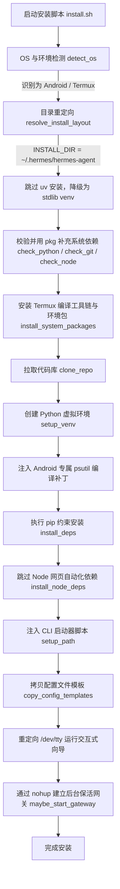

# Termux 环境下 Hermes Agent 安装流程分析与开发规划报告

本报告对 `NousResearch/hermes-agent` 的官方 Linux 安装脚本（`install.sh`）在 **Termux (Android)** 环境下的执行逻辑进行了深度剖析。通过对脚本中环境检测、依赖安装、特异性补丁、环境构建及守护进程管理等模块的逆向，将其精细拆解为可供代码实现的标准化步骤与技术细节，为后续使用 Java/Python 等语言进行自动化安装开发提供完整的技术规划蓝图。

---

## 1. Termux 环境安装时序与架构图

在 Termux 环境下，由于没有标准的 FHS 根目录架构、缺乏 `systemd` 守护进程支持，且 Android 端的 Python `psutil` 编译存在天然缺陷，脚本采取了一套特异性的分支策略：



---

## 2. Termux 环境下的详细执行步骤拆解

### 步骤一：环境特异性检测与路径重定向

1. **Termux 环境判定 (`is_termux`)**：
   * **检测依据**：检查环境变量 `${TERMUX_VERSION}` 是否非空，或者判定 `${PREFIX}` 环境变量是否包含 `com.termux/files/usr`。
   * **代码指令**：
     ```bash
     [ -n "${TERMUX_VERSION:-}" ] || [[ "${PREFIX:-}" == *"com.termux/files/usr"* ]]
     ```
2. **操作系统标识定义**：
   * 判定 `DISTRO="termux"`，`OS="android"`。
3. **安装路径重定向 (`resolve_install_layout`)**：
   * **普通 Linux 根用户**：默认使用 FHS 规范，安装在 `/usr/local/lib/hermes-agent`。
   * **Termux 用户**：由于受限沙盒环境，路径被强制收敛重定向至用户家目录：
     * 代码目录 `INSTALL_DIR` 设为 `~/.hermes/hermes-agent`。
     * 配置与数据目录 `HERMES_HOME` 默认为 `~/.hermes`。

---

### 步骤二：跳过轻量包管理器 uv 并降级

1. **UV 避让策略 (`install_uv`)**：
   * 官方在普通 Linux/macOS 上默认使用极速包管理器 `uv` 来托管 Python 版本与虚拟环境。
   * 在 Termux 中，由于 `uv` 对 Android 平台的支持及 ABI 差异，脚本执行时如果判定 `DISTRO == "termux"`，则主动跳过 `uv` 的下载与配置，将 `UV_CMD` 置空，全部**降级退守至 Python 标准库 `venv` 和原生 `pip`**。

---

### 步骤三：基于 Termux `pkg` 的基础依赖自动补全

脚本对运行所需的基础解释器和命令进行了静默检测，若缺失则通过 Termux 的包管理器 `pkg` 自动安装：

| 校验组件 | 检测命令 | 缺失时在 Termux 下执行的安装指令 | 作用说明 |
| :--- | :--- | :--- | :--- |
| **Python** | `command -v python` 并验证版本 $\ge 3.11$ | `pkg install -y python` | 核心程序运行环境 |
| **Git** | `command -v git` | `pkg install -y git` | 用于拉取和更新 Hermes 源码仓库 |
| **Node.js** | `command -v node` | `pkg install -y nodejs` | 为未来可能集成的网页工具或 TUI 提供支持 |

---

### 步骤四：自动构建 Android 本地编译环境 (`install_system_packages`)

由于 Android 设备（ARM64/ARMv7）在 PyPI 上经常缺乏预编译好的二进制轮子（Wheels），许多 Python 依赖包需要在本地通过 C/Rust 编译器即时编译（Compile from sdist）。

脚本会自动使用 `pkg` 安装一套微型的**安卓本地交叉编译工具链**：
1. **基础构建依赖包**：
   * `clang`（C/C++ 编译器）
   * `rust`（Rust 编译器，用于编译现代加密/安全包）
   * `make`（构建管理器）
   * `pkg-config`（辅助编译器查找库路径）
   * `libffi`（C 接口外部函数库）
   * `openssl`（加密套接字协议库）
   * `ca-certificates` 与 `curl`（网络证书与请求工具）
2. **可选可选功能依赖包**：
   * `ripgrep`（若系统中无 `rg`，用于大文件及代码段的高速正则检索）
   * `ffmpeg`（若系统中无 `ffmpeg`，用于语音消息 TTS 编解码处理）
3. **最终执行的合并安装指令**：
   ```bash
   pkg install -y clang rust make pkg-config libffi openssl ca-certificates curl ripgrep ffmpeg
   ```

---

### 步骤五：代码库拉取与 Venv 虚拟环境构建

1. **代码库克隆 (`clone_repo`)**：
   * 优先尝试 SSH 协议拉取：`git clone --branch main git@github.com:NousResearch/hermes-agent.git ~/.hermes/hermes-agent`。
   * 若失败（通常是未配置 SSH Key），则自动回退到 HTTPS 协议拉取：
     ```bash
     git clone --branch main https://github.com/github.com/NousResearch/hermes-agent.git ~/.hermes/hermes-agent
     ```
2. **创建沙盒虚拟环境 (`setup_venv`)**：
   * 切换至代码目录：`cd ~/.hermes/hermes-agent`。
   * 调用 Termux 原生 Python 虚拟环境模块：
     ```bash
     python -m venv venv
     ```

---

### 步骤六：注入 Android 专用 Psutil 编译补丁与包安装

这是 Termux 环境下**最关键、最容易失败**的步骤。

1. **Android API 级别自动映射**：
   * 尝试通过 Android 系统属性获取 SDK 版本，用于 C 编译器编译时的环境变量注入：
     ```bash
     export ANDROID_API_LEVEL=$(getprop ro.build.version.sdk || echo "24")
     ```
2. **升级基础打包工具**：
   * 确保虚拟环境中的打包工具最新，减少编译报错：
     ```bash
     ./venv/bin/python -m pip install --upgrade pip setuptools wheel
     ```
3. **注入 `psutil` 安卓兼容性补丁 [技术难点]**：
   * **痛点**：标准 `psutil` 库的 `setup.py` 在执行时检测到 `sys.platform == 'android'` 会直接抛出不支持异常而拒绝编译。
   * **解决方案**：脚本在执行 `pip install` 前，先调用专为 Android 编写的补丁器：
     ```bash
     ./venv/bin/python ~/.hermes/hermes-agent/scripts/install_psutil_android.py --pip "./venv/bin/python -m pip"
     ```
     该脚本会临时拦截并修改 `psutil` 源码，使其以类似 Linux 的编译路径成功在 Termux 中完成编译。
4. **渐进式 Profile 约束依赖安装 (`install_deps`)**：
   为了防止因个别重型 extras 包无法在安卓上编译而导致整个安装流程挂掉，脚本采用**三级渐进降级**的安装策略：
   * **第一级：全功能尝试**（排除 Matrix 端到端加密与本地 Whisper 音频识别等已知安卓编译死锁包）：
     ```bash
     ./venv/bin/python -m pip install -e '.[termux-all]' -c constraints-termux.txt
     ```
   * **第二级：若失败，退守基线安装**：
     ```bash
     ./venv/bin/python -m pip install -e '.[termux]' -c constraints-termux.txt
     ```
   * **第三级：若仍失败，仅安装核心 CLI**：
     ```bash
     ./venv/bin/python -m pip install -e '.' -c constraints-termux.txt
     ```

---

### 步骤七：跳过 Node 网页自动化依赖

* **执行策略**：由于 Playwright 及其绑定的 Chromium 浏览器引擎暂时无法直接在 Termux 沙盒环境下无缝拉起运行，脚本中包含以下显式拦截：
  ```bash
  if [ "$DISTRO" = "termux" ]; then
      log_info "Skipping automatic Node/browser dependency setup on Termux"
      # 跳过 npm install 及 npx playwright install chromium
  fi
  ```

---

### 步骤八：注入 CLI 启动器脚本

1. **确定 Bin 软链接目录 (`get_command_link_dir`)**：
   * 在 Termux 下，可执行文件链接目录为 `$PREFIX/bin`（即 `/data/data/com.termux/files/usr/bin`）。
2. **生成 Shell 包装启动器 (`setup_path`)**：
   * 为了解决多项目切换时可能发生的 `PYTHONPATH` 污染以及方便用户全局调用，脚本会在 Termux 的公共 Bin 目录下生成一个无污染的启动包装文件：
     ```bash
     cat > /data/data/com.termux/files/usr/bin/hermes <<EOF
     #!/bin/sh
     unset PYTHONPATH
     unset PYTHONHOME
     exec "$HOME/.hermes/hermes-agent/venv/bin/hermes" "\$@"
     EOF
     chmod +x /data/data/com.termux/files/usr/bin/hermes
     ```

---

### 步骤九：拷贝配置文件模板与同步内置技能

1. **建立结构化数据文件夹**：
   * 批量创建数据仓储子目录：
     ```bash
     mkdir -p ~/.hermes/{cron,sessions,logs,pairing,hooks,image_cache,audio_cache,memories,skills}
     ```
2. **配置文件初始化**：
   * 拷贝并收紧 API 密钥环境变量文件（权限设为仅所有者读写）：
     ```bash
     cp ~/.hermes/hermes-agent/.env.example ~/.hermes/.env
     chmod 600 ~/.hermes/.env
     ```
   * 拷贝核心配置文件：
     ```bash
     cp ~/.hermes/hermes-agent/cli-config.yaml.example ~/.hermes/config.yaml
     ```
   * 创建灵魂设定描述模板：`~/.hermes/SOUL.md`。
3. **内置技能同步**：
   * 运行同步工具将内置 Skills 塞入配置目录：
     ```bash
     ~/.hermes/hermes-agent/venv/bin/python ~/.hermes/hermes-agent/tools/skills_sync.py
     ```

---

### 步骤十：重定向 TTY 唤起交互式向导与后台保活网关

1. **命令行 TTY 穿透重定向 (`run_setup_wizard`)**：
   * 由于大部分用户是通过 `curl ... | bash` 管道下载执行本脚本，这会导致当前进程的 `stdin` 被脚本文件流占用。
   * 为了能让用户在终端中进行交互输入，脚本在调用 Python 引导程序时，**显式将标准输入重定向回 `/dev/tty` 控制台设备**：
     ```bash
     ~/.hermes/hermes-agent/venv/bin/python -m hermes_cli.main setup < /dev/tty
     ```
2. **Termux 后台保活守护进程启动 (`maybe_start_gateway`)**：
   * 检测 `.env` 中是否配置了外部集成（如 Telegram/Discord Bot 密钥）。
   * 由于 Android/Termux 缺乏 `systemd` 系统服务，因此使用 `nohup` 配合后台挂起，把网关以守护进程的形式塞入安卓后台运行：
     ```bash
     nohup hermes gateway > ~/.hermes/logs/gateway.log 2>&1 &
     ```
   * **安全提示**：向安卓用户警告“当 Termux 处于非活跃状态或系统内存紧张时，Android 操作系统可能会强制杀死该后台进程”，提示用户在 Android 系统设置中为 Termux 开启“无限制电池优化”。

---

## 3. 开发者代码实现步骤规划与设计说明

如果您准备将这一套复杂的 Bash 安装脚本用代码（如 Python 安装包、Node.js 部署脚本或 Java 二进制工具）进行重构，可以按照以下六个核心步骤进行模块化设计：

### 阶段一：目标主机环境扫描器 (Environment Scanner)

* **目标**：收集运行主机的元数据，决定安装路由。
* **开发职责**：
  1. 读取系统环境变量，检查是否存在 `TERMUX_VERSION` 或 `PREFIX` 包含 `com.termux` 字段，标识 `isTermux = true`。
  2. 执行系统命令探测：`git --version`、`python3 --version`、`node --version`。
  3. 执行 `getprop ro.build.version.sdk` 探测 Android SDK API Level。

### 阶段二：系统包补全器 (System Package Provisioner)

* **目标**：自动调用底层包管理器，将运行与编译所需的工具链补齐。
* **开发职责**：
  1. 如果 `isTermux` 为 true：
     * 构建待安装包数组：`["python", "git", "nodejs", "clang", "rust", "make", "pkg-config", "libffi", "openssl", "ca-certificates", "curl", "ripgrep", "ffmpeg"]`。
     * 调用子进程执行：`pkg install -y <package_list>`。
  2. 如果在普通 Linux/macOS 下，则对应映射为 `apt-get`、`dnf` 或 `brew` 的执行。

### 阶段三：沙盒虚拟环境构建器 (Venv & Patch Deployer)

* **目标**：克隆代码，建立隔离的 Python venv，并注入 Android 专属补丁。
* **开发职责**：
  1. 执行 `git clone` 将源码拉取至 `~/.hermes/hermes-agent`。
  2. 调用当前系统的 Python 执行器执行：`python -m venv venv`。
  3. **[核心步骤]** 执行补丁程序：调用 CWD 下的 `venv/bin/python scripts/install_psutil_android.py`。
  4. 顺序调用 Pip 安装，并捕获 `sys.stderr`。如果发生编译错误，依次降级到下一个 Profile（`.[termux-all]` $\rightarrow$ `.[termux]` $\rightarrow$ `.`）。

### 阶段四：资产与模板配置器 (Assets & Config Provisioner)

* **目标**：初始化文件系统资产。
* **开发职责**：
  1. 递归创建 `~/.hermes` 目录下的 9 大核心文件夹。
  2. 将配置模板 `cli-config.yaml.example` 拷贝为 `config.yaml`。
  3. 创建包含隐私敏感 API 密钥的 `.env` 文件，并设置严格的文件权限（在 POSIX 系统下执行 `chmod 600`，在 Windows 下进行 ACL 限制）。
  4. 触发内置技能（Skills）向数据目录的同步。

### 阶段五：系统级软链接与启动包装器 (Command Linker)

* **目标**：向系统暴露全局可执行命令 `hermes`。
* **开发职责**：
  1. 读取 Termux 环境下的 `$PREFIX/bin` 路径。
  2. 动态生成包装 Shell 脚本，写入 `unset PYTHONPATH` 和 `unset PYTHONHOME`，并使用 `exec` 替换进程，避免多余子进程开销。
  3. 将生成的包装器写入 `$PREFIX/bin/hermes`，并赋予 `0755` (可执行) 权限。

### 阶段六：保活网关启动器 (Gateway Daemonizer)

* **目标**：处理安装完成后的服务拉起。
* **开发职责**：
  1. 唤醒配置向导程序，将输入流重定向至 TTY 设备以保障交互性。
  2. 如果用户选择后台运行，由于 Termux 缺乏 `systemd`，需要通过代码派生（Spawn）脱离控制台的孤儿进程（Orphan Process）：
     * 设置 `detached: true` 和 `stdio: 'ignore'`，以防止 Node.js/Java 主进程退出时将 `hermes gateway` 进程连带杀死。
