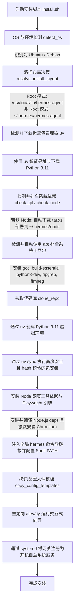

# Ubuntu 环境下 Hermes Agent 安装流程分析与开发规划报告

本报告对 `NousResearch/hermes-agent` 的官方 Linux 安装脚本（`install.sh`）在 **Ubuntu (Debian-based Linux)** 环境下的执行逻辑进行了深度剖析。将其精细拆解为可供代码实现的标准化步骤与技术细节，为后续使用 Java/Python 等语言进行自动化安装开发提供完整的技术规划蓝图。

---

## 1. Ubuntu 环境安装时序与架构图

在 Ubuntu 环境下，系统支持标准的 FHS 根目录架构、具备 `systemd` 系统服务控制中心，并且优先采用极速包管理器 `uv` 来托管 Python 版本与虚拟环境。



---

## 2. Ubuntu 环境下的详细执行步骤拆解

### 步骤一：环境识别与安装路径布局抉择

1. **OS 判定 (`detect_os`)**：
   * 读取 `/etc/os-release`，识别并判定 `OS="linux"`，`DISTRO="ubuntu"`。
2. **安装路径分配决策 (`resolve_install_layout`)**：
   * **Root 模式**（如 Docker 容器、具有全局 sudo 的特权级服务账号，且此前不存在家目录 legacy 部署）：
     * 采用标准的 FHS 目录结构布局（`ROOT_FHS_LAYOUT=true`）。
     * 代码目录 `INSTALL_DIR` 设为 `/usr/local/lib/hermes-agent`。
     * 可执行命令链接位置定为系统公共目录 `/usr/local/bin/hermes`。
   * **非 Root 模式**（普通用户）：
     * 重定向到用户 scoped 沙盒。
     * 代码目录 `INSTALL_DIR` 设为 `~/.hermes/hermes-agent`。
     * 命令软链接存放在 `~/.local/bin/hermes`。
   * 配置和数据目录 `HERMES_HOME` 始终默认指向宿主用户的 `~/.hermes`。

---

### 步骤二：安装极速包管理器 `uv` (`install_uv`)

为了彻底摆脱系统 apt 源 Python 版本过旧或被 `externally-managed` 限制的限制，系统引入了 `uv` 包管理器：
1. **现有 `uv` 检测**：
   * 依次在 `PATH`、`~/.local/bin/uv`、`~/.cargo/bin/uv` 中检索是否已有 `uv` 可执行二进制。
2. **静默下载与安装**：
   * 若无，从官方 CDN 下载引导程序：`curl -LsSf https://astral.sh/uv/install.sh -o /tmp/uv-installer.sh`。
   * 执行 Shell 引导：`sh /tmp/uv-installer.sh`（默认释放到 `~/.local/bin/uv`）。
   * 将 `UV_CMD` 指向所释放的二进制文件绝对路径。

---

### 步骤三：基于 `uv` 托管并获取 Python 3.11 (`check_python`)

1. **Python 3.11 寻址**：
   * 执行 `uv python find 3.11` 查找系统或此前由 uv 托管的 3.11 二进制程序。
2. **Python 版本沙盒下载**：
   * 若未检索到，则利用 `uv` 免 Root 权限直接向 Astral CDN 下载预编译好的专属 Python 运行版本：
     ```bash
     uv python install 3.11
     ```
   * 提取返回的 Python 解析器路径赋值给 `PYTHON_PATH`，作为后续步骤的运行底座。

---

### 步骤四：基础依赖补全 (Git & Node.js)

1. **Git 依赖检测 (`check_git`)**：
   * 检测 `command -v git` 是否就绪。若缺失，则自动调用 apt 完成安装。
2. **Node.js 自动部署方案 (`check_node` & `install_node`)**：
   * 用于界面渲染（TUI）和 Playwright 浏览器自动化技能。
   * **缺失处理**：若系统中缺失 Node，脚本会避免污染系统全局，而是**在沙盒中自主闭环部署 Node.js 二进制包**：
     * **架构解析**：检测 `uname -m`（`x86_64` $\rightarrow$ `x64`，`aarch64/arm64` $\rightarrow$ `arm64`）。
     * **动态寻址**：向 `https://nodejs.org/dist/latest-v22.x/` 发送 curl 请求，提取最新的 `node-v22.x.x-linux-ARCH.tar.xz` 文件名。
     * **静默下载与解包**：下载后解压并直接放置在 `~/.hermes/node/` 中。
     * **符号链接构建**：将 `~/.hermes/node/bin/node`、`npm`、`npx` 符号链接（`ln -sf`）至用户级的软链接 bin 目录（如 `~/.local/bin/`）。

---

### 步骤五：利用 `apt` 批量补全系统级组件 (`install_system_packages`)

当安装检测到组件缺失，或者在非交互模式下探测到依赖未就绪，脚本会通过系统的 `apt`（如非 Root 用户会通过 `sudo`）安装以下系统组件：

1. **需要被补全的依赖列表**：
   * `build-essential` & `python3-dev` & `libffi-dev`：用于编译含 C 扩展的 Python 包（例如一些高性能的加密或数据处理包）。
   * `ripgrep`（若系统中无 `rg`）：大 codebase 极速文本搜索依赖。
   * `ffmpeg`（若系统中无 `ffmpeg`）：多媒体语音转换与 TTS 工具依赖。
2. **防中断静默安装参数**：
   * 注入 `DEBIAN_FRONTEND=noninteractive` 和 `NEEDRESTART_MODE=a` 环境变量，阻止 Ubuntu 下由于更新包导致的需要重启服务（`needrestart`）的交互式紫色弹窗阻塞进程。
   * **最终调用指令**：
     ```bash
     sudo DEBIAN_FRONTEND=noninteractive NEEDRESTART_MODE=a apt-get install -y build-essential python3-dev libffi-dev ripgrep ffmpeg
     ```

---

### 步骤六：代码拉取与基于 `uv` 的虚拟环境同步

1. **Git 拉取源码 (`clone_repo`)**：
   * 将仓库克隆至 `INSTALL_DIR` 目录。
2. **构建 Python 3.11 专属 venv 虚拟环境 (`setup_venv`)**：
   * 在代码根目录下，运行 `uv` 建立强绑定的隔离虚拟环境：
     ```bash
     uv venv venv --python "3.11"
     ```
3. **依赖同步与 Hash 安全校验 (`install_deps`) [核心安全性保障]**：
   * 在虚拟环境中，如果代码目录下包含强锁定的 `uv.lock`，则开启 **Tier 0（散列哈希锁文件安全校验）** 级安装：
     ```bash
     uv sync --extra all --locked
     ```
     *此命令会根据 lock 记录的 SHA256 值在本地编译与校验所有三方库，彻底封死网络劫持带来的上游恶意包注入风险。*
   * 若锁文件缺失，则降级进行 PyPI 联网解算安装：
     ```bash
     uv pip install -e ".[all]"
     ```
     *（若因为系统库缺失导致个别重型可选集成安装失败，则降级回退至 `.[all]` 排除掉坏包的精简 Spec 或核心 `.` CLI 包安装，确保基本功能正常启动）*

---

### 步骤七：网页自动化依赖与 Playwright 引擎安装 (`install_node_deps`)

1. **Node packages 部署**：
   * 进入代码根目录与 TUI 目录，静默执行：`npm install` 补齐 JavaScript 环境依赖。
2. **Playwright 浏览器静默配置**：
   * **无特权常规安装**：
     在本地用户缓存中下载 Chromium 浏览器：
     ```bash
     npx playwright install chromium
     ```
   * **特权依赖补全**（当用户有免密 sudo 或者已经是 root 时）：
     除了浏览器，Playwright 运行时需要一些基础的系统级 X11/Mesa/Codec 共享库（如 `libatk`，`libxkbcommon`）。脚本会自动使用底层命令将其打入系统：
     ```bash
     sudo npx playwright install-deps chromium
     ```

---

### 步骤八：系统级软链接与启动配置写入 (`setup_path`)

1. **确定 Bin 软链接位置**：
   * Root 模式：`/usr/local/bin`
   * 非 Root 模式：`~/.local/bin`
2. **创建 hermes 命令启动包装器**：
   * 写入软链接路径，清空不一致的环境变量，防止在多用户或多 Python 环境变量下由于继承造成的 Python 包阴影（Module Shadowing）报错：
     ```bash
     cat > /usr/local/bin/hermes <<EOF
     #!/bin/sh
     unset PYTHONPATH
     unset PYTHONHOME
     exec "/usr/local/lib/hermes-agent/venv/bin/hermes" "\$@"
     EOF
     chmod +x /usr/local/bin/hermes
     ```
3. **环境变量自动补充**：
   * 检查用户的 `~/.bashrc`、`~/.profile`、`~/.zshrc` 是否已将链接文件夹包含在 `PATH` 中。
   * 若无，自动追加写入：
     ```bash
     export PATH="$HOME/.local/bin:$PATH"
     ```

---

### 步骤九：配置文件初始化与本地资源同步 (`copy_config_templates`)

1. **数据目录创建**：
   * 在 `~/.hermes/` 下递归建立缓存、记忆体、会话、技能、日志共 9 个必要的数据与配置子目录。
2. **模板资产拷贝**：
   * 自动拷贝并保护 `.env`（设置 `chmod 600`，只允许当前 owner 进行读写以保障 API Key 密匙池安全）。
   * 拷贝核心 `config.yaml` 基础配置，并生成默认 `SOUL.md`性格配方。
3. **本地内置技能树同步**：
   * 运行 Python 脚本，以本地文件清单为蓝本将捆绑技能同步到配置空间中：
     ```bash
     ./venv/bin/python tools/skills_sync.py
     ```

---

### 步骤十：重定向标准输入运行交互向导并部署 systemd 自启服务

1. **交互向导设备重定向 (`run_setup_wizard`)**：
   * 为了解决用户在使用类似 `wget -qO- ... | bash` 这样极具便利性的管道命令安装时出现的输入流被文件占用问题，安装器底层进行了精确的命令行 TTY 设备重定向：
     ```bash
     ./venv/bin/python -m hermes_cli.main setup < /dev/tty
     ```
     让控制台能够完美截获并回应用户的终端按键响应。
2. **Systemd 系统级开机服务自动注册 (`maybe_start_gateway`)**：
   * **检测依据**：检查 `~/.hermes/.env` 中是否已录入了 Telegram/Discord/Slack/WhatsApp 等机器人的联网 Token 资产。
   * **服务注册与启动**：如果系统有 `systemctl`（Ubuntu 的标准 init 守护进程），且用户确认，安装器会调用后端原生命令注册系统服务：
     ```bash
     hermes gateway install
     ```
     *此命令会在 `/etc/systemd/system/hermes.service` 自动写入服务描述配置，托管 Agent 网关生命周期。*
   * **自启管理**：
     ```bash
     hermes gateway start  # 本质上执行 systemctl daemon-reload && systemctl enable --now hermes
     ```

---

## 3. 开发者代码实现步骤规划与设计说明

如果您准备用 Java/Python/Node 编写一套在 Ubuntu 平台下自主闭环部署 Hermes 客户端的自动化运维工具，您可以直接按照以下六大阶段进行业务逻辑的模块化拆解：

### 阶段一：目标主机环境扫描器 (Environment Scanner)
* **输入**：系统调用、`/etc/os-release` 及权限 `id -u`。
* **业务逻辑**：
  1. 验证 `DISTRO == "ubuntu"` 或包含 `debian` 家族属性。
  2. 探测 `uid`。若 `uid == 0`，指定全局 `/usr/local/lib/` 安装链路；若为普通用户，指定 `~/.hermes/` 链路。

### 阶段二：系统依赖 provision 补全器 (Apt Package Provisioner)
* **输入**：缺失包数组。
* **业务逻辑**：
  1. 组装待安装列表：`["build-essential", "python3-dev", "libffi-dev", "ripgrep", "ffmpeg", "git"]`。
  2. 针对普通用户前置添加 `sudo`；注入环境变量屏蔽 Ubuntu 重启紫色框弹窗：
     `sudo DEBIAN_FRONTEND=noninteractive NEEDRESTART_MODE=a apt-get install -y <packages>`

### 阶段三：沙盒包管理器及环境挂载器 (Venv & Package manager Bootstrapper)
* **业务逻辑**：
  1. 向 `https://astral.sh/uv/install.sh` 抓取安装文件，部署 `uv` 到特定目录并加入系统运行时环境。
  2. 调用 `uv python install 3.11` 全自动沙盒拉取 3.11 解析器，无需污染主机全局 Python 环境。
  3. 执行 `git clone` 代码，并执行 `uv venv venv --python "3.11"` 构建底层运行沙盒。

### 阶段四：网页引擎与前端依赖构建器 (Node & Browser Provisioner)
* **业务逻辑**：
  1. 如果系统没有 Node，自动解析 `https://nodejs.org/dist/` 抓取 v22 tarball，解压至 `~/.hermes/node`，并在宿主用户 `PATH` 下建立软链接。
  2. 进入安装目录运行 `npm install`。
  3. 通过 `npx playwright install --with-deps chromium` 补齐 Playwright 浏览器资产和底层运行 Codec 库。

### 阶段五：安全配置文件初始化器 (Security Config Synthesizer)
* **业务逻辑**：
  1. 创建 9 大运行文件夹。
  2. 生成 `.env` 并调用 POSIX API 或 chmod 子进程锁定 `600` 读写权限。
  3. 拷贝 `config.yaml` 与同步内置 Skills。

### 阶段六：Systemd 系统服务托管器 (Systemd Service Manager)
* **业务逻辑**：
  1. 通过软链接生成 `hermes` 的全局包装可执行文件。
  2. 在有网关 Token 配置的前提下，派生子进程调用并捕捉系统调用。自动向 `/etc/systemd/system/` 生成自启服务文件，并调用 `systemctl enable --now hermes.service` 挂起，最终向用户返回状态。
